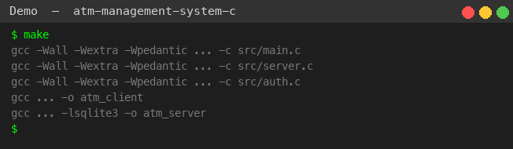
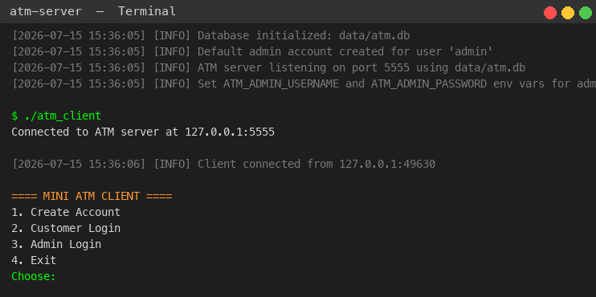
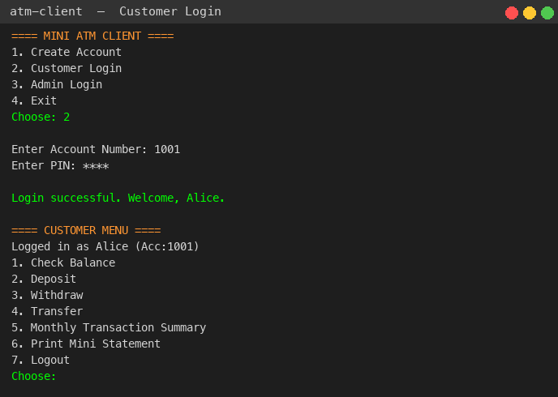
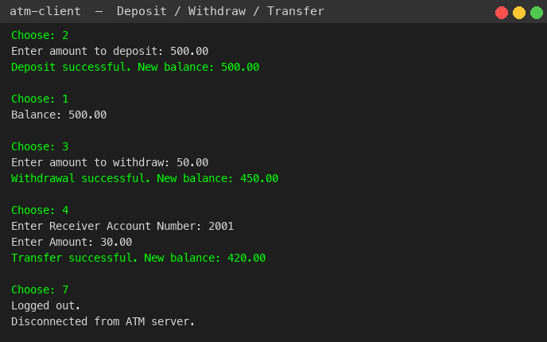
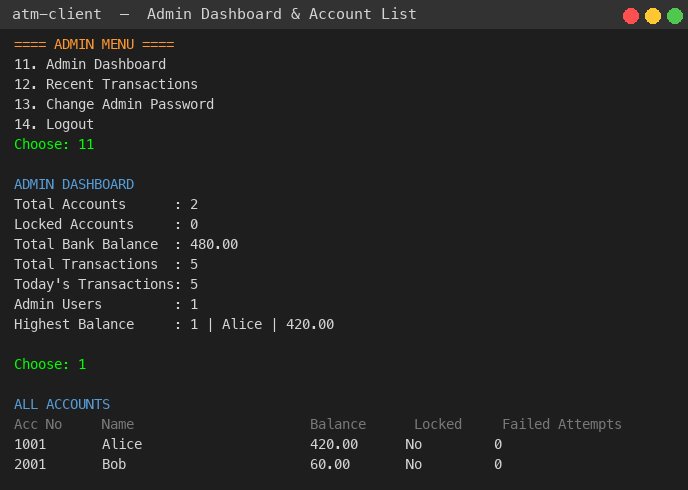
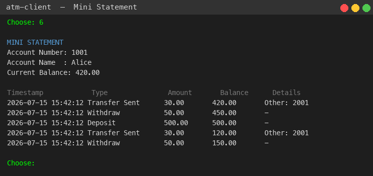
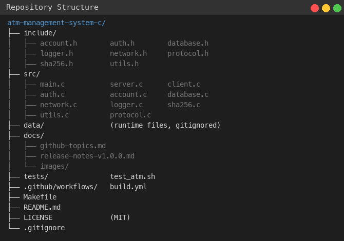

# ATM Management System

[](LICENSE)
[](https://en.wikipedia.org/wiki/C11_(C_standard_revision))
[](https://www.sqlite.org)
[](https://en.wikipedia.org/wiki/POSIX)
[](https://www.linux.org)
[](https://www.apple.com/macos)

A client-server ATM management system written in C using POSIX sockets, SQLite, SHA-256 salted hashing, and a modular architecture.

## Features

**Customer Operations**
- Account creation with 4-digit PIN
- Secure login with account lockout (3 failed attempts)
- Balance inquiry
- Cash deposits and withdrawals
- Fund transfers between accounts
- Mini statement (last 5 transactions)
- Monthly transaction summary

**Admin Operations**
- Admin dashboard (system-wide statistics)
- View all accounts with status
- View detailed account information
- Lock/unlock accounts
- Credit/debit customer accounts
- Edit and delete accounts
- View any account's statement or monthly summary
- View recent transactions across the system
- Administrator password management

**Security**
- PINs and passwords hashed with SHA-256 + per-account 64-bit random salt
- Account lockout after 3 failed login attempts
- No hardcoded credentials (admin credentials via environment variables)
- No credential logging
- Input validation on both client and server side
- Bounds-checked string operations throughout

## Architecture

```
                    ┌──────────────────┐
                    │   atm_client     │
                    │  (CLI frontend)  │
                    └────────┬─────────┘
                             │ TCP (length-prefixed)
                             │ plaintext protocol
                    ┌────────▼─────────┐
                    │   atm_server     │
                    │  (request dispatch)
                    └────────┬─────────┘
                             │
              ┌──────────────┼──────────────┐
              │              │              │
        ┌─────▼────┐  ┌─────▼────┐  ┌─────▼────┐
        │  auth.c  │  │account.c │  │database.c│
        │(login,   │  │(balance, │  │(SQLite   │
        │ create,  │  │ transfer,│  │ core)    │
        │ admin)   │  │ stmts)   │  │          │
        └──────────┘  └──────────┘  └─────┬────┘
                                          │
                                    ┌─────▼────┐
                                    │  SQLite  │
                                    │  (data/) │
                                    └──────────┘
```

### Modules

| Module | Responsibility |
|--------|---------------|
| `main.c` | Server entry: argument parsing, DB init, accept loop |
| `server.c` | Session management, request dispatch |
| `client.c` | CLI user interface, menu flows |
| `auth.c` | Account creation, login, admin auth, password management |
| `account.c` | Balance, deposits, withdrawals, transfers, statements, admin ops |
| `database.c` | SQLite connection, schema, migrations, shared DB helpers |
| `network.c` | Socket creation and client connection |
| `protocol.c` | Length-prefixed message framing |
| `logger.c` | Structured logging with timestamps |
| `sha256.c` | Embedded SHA-256 implementation with salt generation |
| `utils.c` | String parsing, time utilities, stdin I/O |

## Project Structure

```
atm-management-system-c/
├── include/            # Header files
│   ├── account.h
│   ├── auth.h
│   ├── database.h
│   ├── logger.h
│   ├── network.h
│   ├── protocol.h
│   ├── sha256.h
│   └── utils.h
├── src/               # Source files
│   ├── main.c         # Server entry point
│   ├── server.c       # Request dispatch + sessions
│   ├── client.c       # CLI client
│   ├── auth.c         # Authentication
│   ├── account.c      # Account operations
│   ├── database.c     # Database core
│   ├── network.c      # Socket utilities
│   ├── logger.c       # Logging
│   ├── sha256.c       # SHA-256 implementation
│   ├── utils.c        # Utility functions
│   └── protocol.c     # Wire protocol
├── data/              # Runtime data (gitignored)
├── docs/              # Documentation
│   ├── github-topics.md
│   └── release-notes-v1.0.0.md
├── tests/             # Test scripts
├── .github/           # CI/CD workflows
├── Makefile
├── README.md
├── LICENSE            # MIT
└── .gitignore
```

## Technologies

- **Language:** C11 (ISO/IEC 9899:2011)
- **Database:** SQLite 3
- **Networking:** POSIX sockets (TCP)
- **Build:** GNU Make
- **Hashing:** Embedded SHA-256

## Requirements

- GCC or Clang (with C11 support)
- SQLite3 development libraries (`libsqlite3-dev` on Linux, `sqlite3` on macOS via Homebrew)
- POSIX-compatible system (Linux, macOS)

### Installing SQLite3

**Linux (Debian/Ubuntu):**
```bash
sudo apt-get install libsqlite3-dev
```

**macOS:**
```bash
brew install sqlite3
```

## Build

```bash
git clone https://github.com/navogit55/atm-management-system-c.git
cd atm-management-system-c
make
```

This produces two binaries: `atm_client` and `atm_server`.

### Build Variants

```bash
make          # Default release build
make debug    # Debug build with -g -O0
make release  # Optimized release build -O3
make clean    # Remove object files and binaries
make distclean # Remove all generated files including database
```

## Usage

### 1. Start the server

```bash
export ATM_ADMIN_USERNAME="admin"
export ATM_ADMIN_PASSWORD="YourSecurePassword123"
./atm_server [port] [database_path]
```

The server defaults to port 5555 and stores data in `data/atm.db`.  
On first run, it creates an admin account using the environment variables above.

> **Warning:** Never use weak or default admin credentials in any environment
> that matters. The admin password must be at least 8 characters long.

### 2. Connect with the client

```bash
./atm_client [host] [port]
```

Default host is `127.0.0.1` and default port is `5555`.

### Demo Walkthrough

```
==== MINI ATM CLIENT ====
1. Create Account
2. Customer Login
3. Admin Login
4. Exit
Choose: 1
Enter Account Number: 1001
Enter Name: Alice
Set 4-digit PIN: 1234
Account created successfully.

==== MINI ATM CLIENT ====
1. Create Account
2. Customer Login
3. Admin Login
4. Exit
Choose: 2
Enter Account Number: 1001
Enter PIN: 1234
Login successful. Welcome, Alice.

==== CUSTOMER MENU ====
1. Check Balance
2. Deposit
3. Withdraw
4. Transfer
5. Monthly Transaction Summary
6. Print Mini Statement
7. Logout
Choose: 2
Enter amount to deposit: 500.00
Deposit successful. New balance: 500.00
```

## Demo



## Screenshots

The following screenshots illustrate the application in action.

| Screen | Description |
|--------|-------------|
|  | Server boot sequence and log output |
|  | Customer authentication flow |
|  | Customer menu with account operations |
|  | Administrative dashboard and system summary |
|  | Mini statement and recent transactions |
|  | Project file layout |

## Security Considerations

### What This Project Does Right

- **SHA-256 with salted hashes:** PINs and passwords are hashed with SHA-256
  and a per-account or per-admin 64-bit random salt before storage.
- **No plaintext storage:** Raw PINs and passwords are never written to disk.
- **Account lockout:** After 3 failed login attempts, the account is locked
  and must be unlocked by an administrator.
- **No hardcoded credentials:** Admin credentials are read from environment
  variables. The server refuses to start without them.
- **Input validation:** All user inputs are validated on both the client
  and server side before processing.

### Known Limitations (Educational Context)

- **No transport encryption:** Communication between client and server is
  **not encrypted**. A passive attacker on the network can read all traffic,
  including PINs sent during login. In production, this would require TLS.
  Implementing TLS in C is a significant undertaking and is outside the
  scope of this educational project.
- **Non-cryptographic djb2 hash (unsuitable for password storage):** The
  original codebase used the djb2 hash — a fast, non-cryptographic hash
  function designed for hash tables. Like any secure hash, djb2 is not
  reversible (you cannot recover the original input from the digest), but it
  provides no cryptographic security. It is vulnerable to brute-force and
  dictionary attacks and should never be used to store passwords or PINs.
  The refactored project replaces djb2 with **SHA-256** combined with a
  unique per-account 64-bit random salt. However, even SHA-256 is not a
  dedicated password hashing function. Production systems should use
  **argon2**, **bcrypt**, or **scrypt**, which are designed to resist
  brute-force and GPU-based attacks.
- **Sequential client handling:** The server handles one client at a time.
  A concurrent production server would use threading, forking, or an event
  loop (e.g., `epoll` or `kqueue`).
- **Single admin account:** The current schema supports multiple admin
  accounts, but the seeding and admin login logic assume a single admin
  for simplicity.

### Future Improvements

- Add TLS/SSL encryption for network communication
- Replace SHA-256 hashing with argon2 for password storage
- Implement concurrent client handling (fork, pthreads, or epoll)
- Add a web-based admin dashboard
- Add transaction categories and receipt generation
- Support multiple admin accounts
- Add rate limiting on login attempts
- Session tokens instead of per-request authentication

## Testing

```bash
make test
```

This runs the automated test script which exercises account creation,
login, deposit, withdrawal, transfer, and admin operations.

## License

This project is licensed under the MIT License — see the [LICENSE](LICENSE) file for details.
